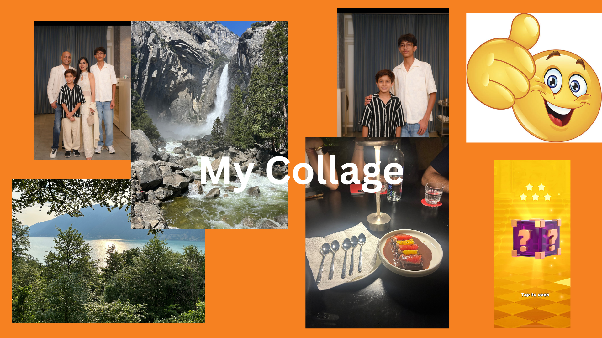

# Me in markdown
## Introduction

Hi, my name is Shubham Gupta and I'm in the 10th grade at Chatsworth Charter High School. My favorite book series is the Percy Jackson series because I was very invested in the Mythology and how it was integrated into the series. My favorite movie is probably Cars 2 because of how Mator became a detective. A new skill I learned is how to solve a Rubiks Cube. Goals for this school year is I want to end the year with all A's. Also at the end of the year i want to get a 4 or higher on the AP Exams.

I went to India over the summer to celebrate my Grandpa's birthday. I spent 2 and a half weeks there and I met most of my family and had a great time. Another summer traveling experience I had was when I went to Switzerland. It was a beautiful place to see especially with the immense amount of nature beauty it's filled with. My most memorable experience this summer was my Grandpa's birthday.

My favorite summer memory with my friends was when I went to the movies with my friends to watch Superman. We had a great time at the movies and spent a good time a the mall too. My experiences so far have helped my future aspirations in doing something with biotechnology. I've been trying to get into a biotech internship and I hope by the end of the school year I could get one or two.
## My Playlist 

[This is my playlist](https://music.apple.com/us/playlist/stay-lit/pl.u-11zBJ73cN3Wryxm)
## My Collage/Mood Board
